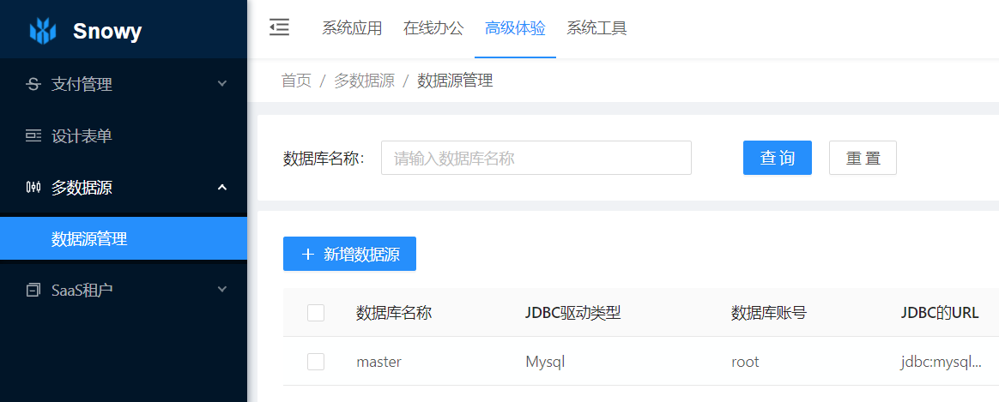

多数据源
====


多数据源介绍
----

> 多数据源的使用，有效的解决一套软件，链接多个数据库，获取多数据库的数据，或不同类型数据库的数据来整合业务。
>
> 也有部分公司老系统过多，无法单独提供系统API，这个时候使用多数据源进行接口的封装管理及数据大屏的数据解决方案就诞生。

该 `文档与插件模块` 由 [@小诺](https://gitee.com/xiaonuobase) 出品

添加编辑数据源
----
（增改多数据源）

以往配置多数据源的方式，是有多少个数据源，研发人员都需要吧数据源信息每一项挨个写入到`application-***.yml`文件中，现在Snowy团队结合之前所积累的经验，添加数据源统统由可视化界面完成。

运行企业版项目代码，登录成功之后，看到如下界面：



点击`新增数据源`按钮，填写基本信息，数据源名称最好以英文，这些是要用在代码里面

选择驱动，实则就是我们字典中添加的各个不同类型数据库的驱动导包那一串，使用其他数据源（Snowy框架支持的）可自己在字典中添加。

> PS：注意主数据源不可被删除，不可被修改，因为主数据源是配置在`application-***.yml`环境中的，也是项目启动默认必须有一个数据源的。

代码应用到数据源
----

当我们的功能界面添加好了数据源信息以后，代码上面就可以使用注解的方式，获取数据源的数据啦！

> 在需要查询`minor`数据源的service方法实现类上面增加以下注解：
```java
@DataSource(name = "minor")
```

这个时候service方法返回一个list列表，或者是分页列表，我们取到的数据，无疑是此数据源的数据信息。

这个时候小伙伴问了，为什么其他的service方法都不加此注解，是的，默认不加注解，获得的数据统统是主数据的数据！只有加了注解的实现类，才走指定的数据源去查询，同时，如果使用Snowy项目中规范开发，整个模块的参数类、实体类等等的都与此数据源对应表中的字段关联。

多个数据源之间的数据汇总
----

如果项目使用过程中，统计A库跟B库C库等综合的数据量，该怎么办？

可以使用D controller中或service中引入注解了A、B、C注解的service，拿到每个返回的list或其他需要的结果，汇总到一起写入业务所需。

动态数据源切换
----

```java

```


更新时间
----

该文档最后更新于： 2021年9月14日 00点14分